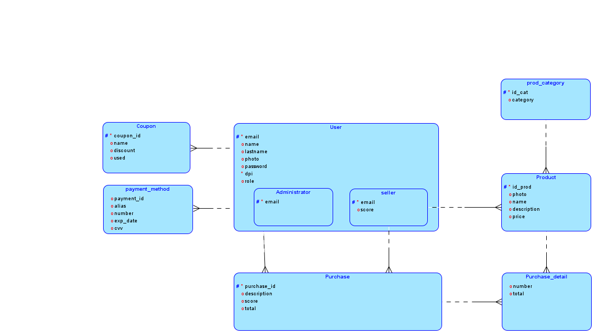

# AYD2_PROYECTO_GRUPO3

## Contenido
- [Datos del grupo 3](#datos)
- [Patrones de diseño](documentation/Patrones%20de%20disenio.md)
- [Modelo de base de datos](#database)
- [Historias de usuario](documentation/UsersHistory.md)
- [Diagrama de implementación](#implementacion)
    - [Diagrama de despliegue](#despliegue)
    - [Diagrama de componentes](#componentes)
- [Manual técnico](documentation/Tecnico.md)
- [Manual del usuario](documentation/Usuario.md)
- [Ceremonias Scrum](#ceremonias)

---

## Datos del grupo 3

| Carné | Estudiante |
| --- | --- |
| 202010055 | Derek Esquivel Díaz |
| 202004804 | José Andrés Montenegro Santos |
| 201906085 | Sebastian Alejandro de Leon Tenaz |
| 201903004 | Jonathan Alexander Alvarado Fernández |
| 201900450 | Luis Andrés de la Peña Pineda |
| 201503756 | Carlos Ernesto Fuentes Rasique |

---

## Modelo de base de datos

A continuación se muestra el diagrama entidad relación de la base de datos almacenada en servicio RDS de AWS

---

## Diagrama de implementación

### Diagrama de despliegue

A continuación se muestra el diagrama de despliegue

### Diagrama de componentes

A continuación se muestra el diagrama de componentes

---

## Ceremonias Scrum

A continuación se muestran las ceremonias de Scrum realizadas:
| Día | Ceremonia | Link | 
| --- | --- | --- |
| 05/02/2024 | Sprint Planning | [link](https://drive.google.com/file/d/12OtWSlaTP_EQn5oDIQwZzzCXrB1moJ53/view?usp=drive_link) |
| 05/02/2024 | Daily Scrum | [link](https://drive.google.com/file/d/1bIPBq27E348q7lYGnV3hTKXM8g6HBCFB/view?usp=drive_link) |
| 07/02/2024 | Daily Scrum | [link](https://drive.google.com/file/d/1kSlLQ85LPJPwoMRW8o2z9a1mIHH36OFD/view?usp=drive_link) |
| 08/02/2024 | Daily Scrum | [link](https://drive.google.com/file/d/1Ee5px_feuHJfNr7hKE5NV2bDyW15a0Js/view?usp=drive_link) |
| 10/02/2024 | Daily Scrum | [link](https://drive.google.com/file/d/1AT3Jw-ZTiNSthqFuRI1B3rGSqdg0DBqj/view?usp=drive_link) |
| 12/02/2024 | Daily Scrum | [link](https://drive.google.com/file/d/1vSHJajzSjftWpAlvprtWm7hCbQTKRHnJ/view?usp=drive_link) |
| 13/02/2024 | Daily Scrum | [link](https://drive.google.com/file/d/1OL0AYsMGQ2JXDdXhg6efOqZHhTshbnIQ/view?usp=drive_link) |
| 14/02/2024 | Daily Scrum | [link](https://drive.google.com/file/d/1OL0AYsMGQ2JXDdXhg6efOqZHhTshbnIQ/view?usp=drive_link) |
| 15/02/2024 | Daily Scrum | [link](https://drive.google.com/file/d/1_vXGSR-MoXHG8YDl1Bq3FWHfqrJrhkbj/view?usp=drive_link) |
| 16/02/2024 | Daily Scrum | [link](https://drive.google.com/file/d/18_aLHbYGauDZ0mqin7ppOhWT3w7fxabL/view?usp=drive_link) |
| 17/02/2024 | Daily Scrum | [link](https://drive.google.com/file/d/1Rk9TnpUWl4SjnZmLW3cz4T_30Y4MVWzg/view?usp=drive_link) |
| 18/02/2024 | Sprint Retrospective | [link](https://drive.google.com/file/d/1zxVm_qv8-7lIpdKsi6ccjXCys9nej-UN/view?usp=drive_link) |
| 19/02/2024 | Sprint Planning | [link](https://drive.google.com/file/d/1CqoYu9AiY4lGkpme_qErsanDZXPm2hm5/view?usp=drive_link) |
| 21/02/2024 | Daily Scrum | [link](https://drive.google.com/file/d/18cBhcVJyt0kpos1T9_5QdF0VreY61woR/view?usp=drive_link) |
| 23/02/2024 | Daily Scrum | [link](https://drive.google.com/file/d/1Y0wqm3QR5tD3NoSwAm1Nu3Zc8KnHXUNc/view?usp=drive_link) |
| 24/02/2024 | Daily Scrum | [link](https://drive.google.com/file/d/1VD6rJmv9QXtGqwlLXMvcyCn2OcrnBFBe/view?usp=drive_link) |
| 26/02/2024 | Daily Scrum | [link](https://drive.google.com/file/d/1Xk7hSJVVO9SnaVuPaqzfXcDlP2oo14LR/view?usp=drive_link) |
| 27/02/2024 | Daily Scrum | [link](https://drive.google.com/file/d/1xfMDcFdBJoMHntoWQyfzcYGfwT3rdH_O/view?usp=drive_link) |
| 28/02/2024 | Daily Scrum | [link](https://drive.google.com/file/d/1pD9NwYMb-GzucVuEstX8IX4fi-1sUsB1/view?usp=drive_link) |

---