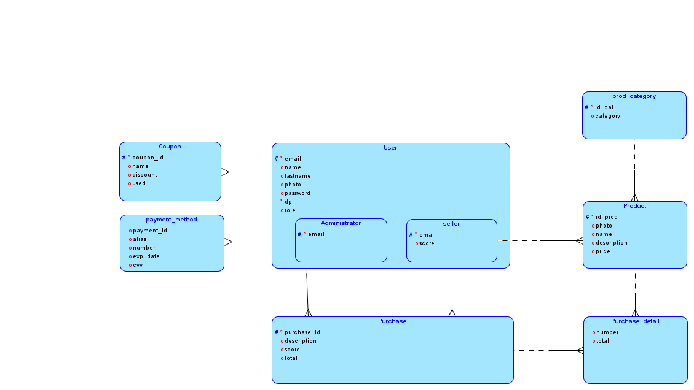

# Manual técnico

## 1. Introducción
Bienvenido al Manual Técnico del Proyecto Marketplace. Este manual está diseñado para proporcionar una guía detallada sobre la arquitectura, desarrollo, despliegue y mantenimiento de nuestro marketplace, un proyecto colaborativo realizado como parte de el curso ***Analisís y Diseño de Sistemas 2***.

### Objetivo del Manual Técnico
El objetivo principal de este manual es ofrecer a los desarrolladores, administradores de sistemas y otros miembros del equipo una comprensión clara y exhaustiva del funcionamiento interno del sistema, así como los procedimientos necesarios para su configuración, despliegue y mantenimiento. Además, este manual servirá como una referencia útil para futuras actualizaciones y mejoras en el proyecto.

### Audiencia
Este manual está dirigido a desarrolladores de software, ingenieros de sistemas, administradores de bases de datos y cualquier otro profesional involucrado en el desarrollo, despliegue y mantenimiento de aplicaciones web. También puede ser útil para estudiantes y otros interesados en comprender los conceptos y tecnologías utilizadas en un proyecto de marketplace.

### Contexto del Proyecto    
El proyecto Marketplace es un marketplace en línea que permite a los usuarios comprar y vender una variedad de productos a través de una plataforma centralizada. El proyecto se desarrolló en un entorno colaborativo como parte de un curso de ***Analisís y Diseño de Sistemas 2***, con el objetivo de aplicar y demostrar habilidades en desarrollo de software, diseño de sistemas y gestión de proyectos.

Durante el desarrollo del proyecto, se implementaron diversas funcionalidades clave, incluyendo la gestión de usuarios, productos, categorías, métodos de pago, entre otras. Estas funcionalidades se integran mediante una API RESTful implementada en Golang para el backend, junto con un cliente web desarrollado con tecnologías como React Vue.

---

## 2. Modelo de Datos:

A continuación se muestra el diagrama entidad relación de la base de datos almacenada en servicio RDS de AWS

---
## 3. Endpoints:

A continuación se describe los endpoints implementados en el backend usando en golang:

| | | | | | | | |
|-|-|-|-|-|-|-|-|
| |Nombre|Tipo|Request|Response|Notas|Estado|Encargado|
| |/all-products|get| |[         {                 product_id: 999,                 nombre: "Producto",                 vendedor: "Juan Perez"                 existencia: 0,                 precio: 0.00,                 descripcion: "Lorem ipsum...",                 imagen: "https://placehold.co/400"         },         {                 ...         },         ... ]|Arreglo de todos los productos en formato JSON|Completado/ En rama main|Ernesto|
| |/create-product|post|{         nombre: "Producto",         vendedor_id: 25412,         precio: 0.00,         descripcion: "Lorem ipsum...",         imagen: "https://placehold.co/400" }|{ 	type: "SUCCESS" "| "ERROR", 	message: "Producto creado con exito" "| "Error: ..." }|Se crea un producto al sistema enviando sus datos, el response indicara si se pudo crear el producto o si existio un error, si hay un error especificar cual| |Jonathan|
| |/product?id=12345|get| |{         product_id: 999,         nombre: "Producto",         vendedor_id: 25412,         disponible: True/False,         precio: 0.00,         descripcion: "Lorem ipsum...",         imagen: "https://placehold.co/400" }|Se obtiene la informacion especifica de un producto, enviando el id del producto como un param|Completado/En rama develop|Ernesto|
| |/my-products?id=1234|get| |[           {              "product_id": 5,              "nombre": "Hershey",               "existencia": 0,               "precio": 8,               "categoria": "Dulces",               "descripcion": "Chocolate con Leche",               "imagen": "https://placehold.co/400"         },         {                 ...         },         ... ]|Arreglo de todos los productos perteniecientes a un vendedor en formato JSON, se envia el id del vendedor como param|Completado/En rama develop|Ernesto|
| |/categories|get| |{    categorias: ["Dulces", "Sodas", ...] }|Arreglo con todas las categorias disponibles| |Jonathan|
| |/user/login|post|{       "email": email,       "password": password, }|{       "id_usuario": 1,       "type": tipo_de_usuario, }|La respuesta es para almacenarlo en el local storage| |José|
| |/user/register|post|{         "name": name,         "email": email,         'dpi': dpi,         "password": password,         "image": "https://placehold.co/400",         "type": "usuario",       }| |Cambio de JSON para que lo que se envíe al backend sea link de S3 de la imagen| |José|
| |/registroRepartidor|post|{         "name": name,         "email": email,         'dpi': dpi,         "password": password,         "image": "https://placehold.co/400",         "type": "repartidor",       }| |Cambio de JSON para que lo que se envíe al backend sea link de S3 de la imagen| |José|
| |/profiles|POST|{    cui: int,   role: string,  }|{ 	name: string, 	email: string, 	cui:int, 	imagen: string(url). 	role: string  }|es valido para admin-vendedor-cliente| |José|
| |/edit-product|post|{          product_id: 999,         nombre: "Producto",         dpi_vendedor: 25412,         categoria: "Dulces",         precio: 0.00,         descripcion: "Lorem ipsum...",         imagen: "https://placehold.co/400" }|{         type: "SUCCESS" "| "ERROR",         message: "Producto edtado con exito" "| "Error: ..." }|Se edita un producto sus datos nuevos datos, el response indicara si se pudo editar el producto o si existio un error, si hay un error especificar cual|Completado/En rama develop|Ernesto|
| |/history-buys|get|[         {                 id_compra: int                 nombre_producto: string                 vendedor: string                 precio: int                 imagen: string(url)                   }... ]| |arreglo de todas las compras de un cliente| | |
| |/history-sales|get|[         {                 id_venta: int                 nombre_producto: string                 comprador: string                 precio: int                 imagen: string(url)                   }... ]| |arreglo de todas las ventas de un vendedor| | |
| |/delete-product?id=1234|delete| |{         type: "SUCCESS" "| "ERROR",         message: "Producto eliminado con exito" "| "Error: ..." }|Elimina un producto, se envia el id del producto como param, el response indicara si se pudo eliminar el producto o si existio un error, si hay un error especificar cual|Completado/En rama develop|Ernesto|
| |/get-soli-seller|get|[         {                 imagen: string(url)                 cui: int                 nombre: string                                           }... ]| |Obtener lista de solicitudes de vendedores para verlos desde admin|En proceso|Ernesto|
| |/user/accept-seller|POST|{  dpi:int  }|{         type: "SUCCESS" "| "ERROR",         message: "Repartidor aceptado" "| "Error: ..." }|para aceptar la solicitud de un vendedor desde admin| |José|
| |/user/decline-seller|POST|{    dpi: int  }|{         type: "SUCCESS" "| "ERROR",         message: "Producto eliminado con exito" "| "Error: ..." }|para denegar la solicitud de un vendedor desde admin| |José|
| |/pending-sellers|GET| |[   {     "name": "nombre_usuario",     "email": "email@mail.com",     "dpi": 123456,     "image": "link imagen",     "role": 0"|1"|2,     "state": 0"|1"|2   } ]|Para obtener la lista de vendedores pendientes de confirmación| |José|
| |/enabled-users|GET| |[   {     "name": "nombre_usuario",     "email": "email@mail.com",     "dpi": 123456,     "image": "link imagen",     "role": 0"|1"|2,     "state": 0"|1"|2   } ]|Lista de usuarios que se encuentren habilitados| |José|
| |/disabled-users|GET| |[   {     "name": "nombre_usuario",     "email": "email@mail.com",     "dpi": 123456,     "image": "link imagen",     "role": 0"|1"|2,     "state": 0"|1"|2   } ]|Lista de usuarios que se encuentren deshabilitados| |José|
| |/user/enable-user|POST|{    dpi: int  }|{         type: "SUCCESS" "| "ERROR",         message: "Usuario habilitado con exito" "| "Error: ..." }|Para habilitar un usuario| |José|
| |/user/disable-user|POST|{    dpi: int  }|{         type: "SUCCESS" "| "ERROR",         message: "Usuario habilitado con exito" "| "Error: ..." }|Para deshabilitar un usuario| |José|

